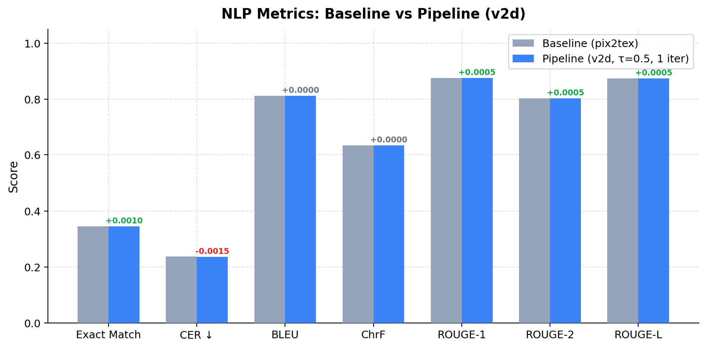
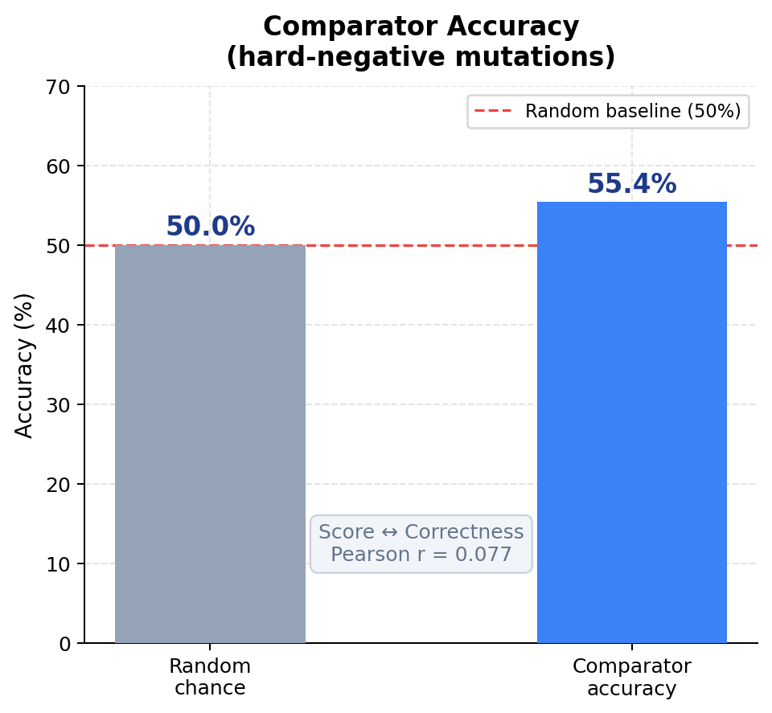
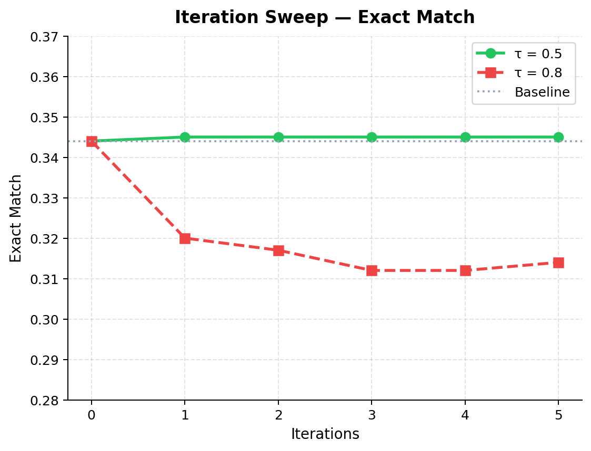
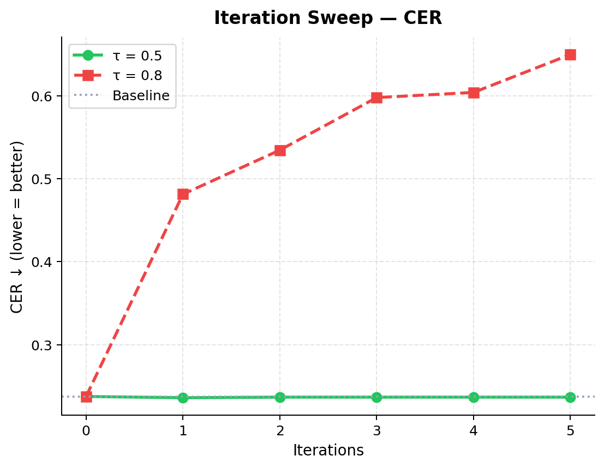
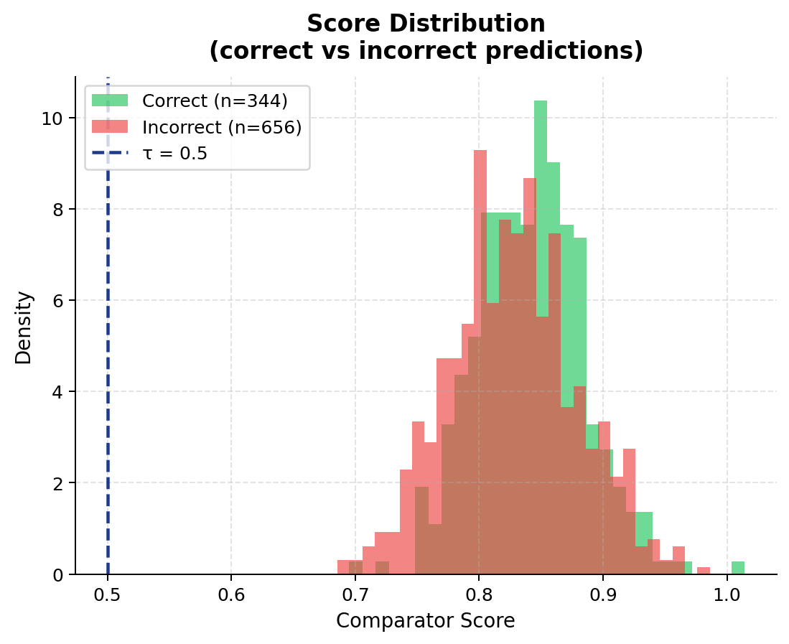

# Self-Correcting LaTeX OCR via Render-and-Compare & XAI Quality Gates

> **AML Course Project** — Two approaches to making a LaTeX OCR model self-aware of its own mistakes and automatically correct them without human feedback.

---

## Overview

[pix2tex](https://github.com/lukas-blecher/LaTeX-OCR) is a state-of-the-art Vision Transformer OCR model that decodes formula images into LaTeX. This project wraps it with a **self-correcting feedback loop** using two independent strategies:

| | Approach 1 | Approach 2 |
|---|---|---|
| **Name** | Siamese Render-and-Compare | XAI Attribution Quality Gate |
| **Signal** | External — render prediction, compare images | Internal — attention maps & gradients |
| **Feedback** | Cosine similarity score between formula images | Attention consistency, diffuseness, Grad-CAM |
| **Author** | Mohamed Abdelmagid | Ahmed Abdeen |

---

## Approach 1 — Siamese Render-and-Compare

### How It Works

```
Formula Image ──► pix2tex ──► LaTeX Prediction
                                     │
                              Render to Image
                                     │
                    ┌────────────────▼────────────────┐
                    │   Siamese Comparator Network     │
                    │  (shared ViT encoder + LoRA)     │
                    │  Formula Image ◄──► Rendered     │
                    │  cosine_similarity → score       │
                    └────────────────┬────────────────┘
                             score < τ?
                            /          \
                          Yes           No
                     Re-decode        Accept
                   (up to N iters)
```

### Architecture — v2d (Final)


- **Backbone:** Shared pix2tex ViT encoder fine-tuned with **LoRA** (rank=8, ~230K trainable params out of 85M)
- **Projection MLP:** `Linear(256) → BatchNorm → GELU → Linear(128)`
- **Similarity:** L2-normalize embeddings → cosine similarity
- **Loss:** Contrastive hinge loss, margin=1.0
- **Score:** `sigmoid(cos_sim × 5)` maps similarity to [0,1]
- **Threshold:** τ=0.5 (architecturally principled: sigmoid(0)=0.5 ↔ orthogonal embeddings)

### Architectures Explored

| Variant | Description | Key Idea |
|---|---|---|
| **v2a** | ResidualHead | Skip-connections + BatchNorm on fused [f_inp, f_rnd, diff, mul] features |
| **v2b** | CrossAttentionComparator | Cross-attention over token sequences — attends to spatial disagreement regions |
| **v2c** | ContrastiveNet (InfoNCE) | Metric learning with InfoNCE/NT-Xent loss on a shared projection space |
| **v2d** ✓ | **True Siamese Network** | Shared encoder + hinge loss; architecturally cleanest; best results |

### Training Setup

- **Dataset:** im2latex / LaTeX_OCR GD split — 74K train / 6.7K val / 30K test formula images
- **Hard negatives:** Synthetic LaTeX mutations (symbol swaps, operator flips, bracket errors, subscript/superscript changes)
- **Hard-negative probability:** 0.5 (curriculum annealing)
- **Optimizer:** AdamW, fp16, HuggingFace Trainer
- **Best val accuracy on hard-negative mutations:** **55.4%**

---

## Approach 2 — XAI Attribution Quality Gate

### How It Works

```
Formula Image ──► pix2tex ──► LaTeX Prediction
                                     │
                         Inspect model's internal signals:
                         ┌───────────────────────────────┐
                         │ • Attention Consistency        │
                         │   (cross-attention focus on    │
                         │    formula regions?)           │
                         │ • Attention Diffuseness        │
                         │   (spread = uncertain,         │
                         │    focused = confident)        │
                         │ • Grad-CAM                     │
                         │   (gradient-weighted spatial   │
                         │    activation consistency)     │
                         │ • Integrated Gradients         │
                         │   (attribution map alignment)  │
                         └───────────────┬───────────────┘
                              Exceeds threshold?
                             /              \
                           Yes              No
                      Re-decode           Accept
```

### XAI Signals

| Signal | Description | Threshold |
|---|---|---|
| **Confidence** | Max softmax probability per token, averaged | > 0.995 |
| **Diffuseness** | Entropy of attention weights (high = uncertain) | < 0.81 |
| **Consistency** | Cross-layer attention map correlation | > 0.06 |
| **Grad-CAM** | Spatial gradient activation vs formula region | — |
| **Integrated Gradients** | Attribution overlap between layers | — |

### Key Result
- **+0.5% BLEU** improvement over baseline in a single re-decode pass

---

## Results — Approach 1



### Full Pipeline vs Baseline (τ=0.5, 1 iteration, 30K test images)

| Metric | Baseline (pix2tex) | Pipeline (v2d) | Δ |
|---|---|---|---|
| Exact Match | 0.3440 | 0.3450 | **+0.001** |
| CER ↓ | 0.2377 | 0.2362 | **−0.0015** |
| BLEU | 0.8119 | 0.8119 | 0.000 |
| ChrF | 0.6337 | 0.6337 | 0.000 |
| ROUGE-1 | 0.8752 | 0.8757 | +0.0005 |
| ROUGE-2 | 0.8024 | 0.8029 | +0.0005 |
| ROUGE-L | 0.8734 | 0.8739 | +0.0005 |

### Comparator Accuracy



- **55.4% accuracy** on hard-negative synthetic mutations vs 50% random chance
- Pearson r = 0.077 between comparator score and OCR correctness
- Finding: comparator detects synthetic mutations well but shows domain mismatch with real OCR errors — only ~0.5% of real predictions fall below τ=0.5

### Iteration Sweep

| | τ=0.5 (1 iter) | τ=0.5 (5 iters) | τ=0.8 (1 iter) | τ=0.8 (5 iters) |
|---|---|---|---|---|
| Exact Match | 0.345 | 0.345 | 0.320 | 0.314 |
| CER ↓ | 0.2362 | 0.2369 | 0.4813 | 0.6496 |




**Key finding:** τ=0.5 is stable across iterations. τ=0.8 aggressively rejects valid predictions, causing metric degradation — confirming domain mismatch between training (synthetic) and inference (real OCR errors).

### Score Distribution



---

## Repository Structure

```
├── code/
│   ├── train_comparator_hf.py          # Base comparator training (v1 architectures)
│   ├── train_comparator_hf_v2.py       # v2a/v2b/v2c/v2d architectures + LoRA
│   ├── self_correcting_render_compare.py  # Full pipeline: OCR + render + compare loop
│   ├── generate_comparator_dataset.py  # Pre-render training pairs to disk
│   ├── evaluate_pix2tex_gd.py          # Baseline pix2tex evaluation (30K images)
│   ├── evaluate_full_pipeline_test.py  # End-to-end pipeline evaluation
│   ├── evaluate_pipeline_from_existing.py  # Pipeline eval from saved predictions
│   ├── compute_consistency_scores.py   # XAI: attention/Grad-CAM/IG scoring
│   ├── run_full_test_sweeps.py         # XAI: sweep quality gate presets
│   ├── plot_xai_scores.py              # XAI: visualise score distributions
│   ├── cli.py                          # Modified pix2tex CLI with XAI hooks
│   └── pix2tex_xai/                    # XAI module
│       ├── consistency.py              # Attribution consistency scoring
│       ├── gradcam.py                  # Grad-CAM implementation
│       ├── integrated_gradients.py     # Integrated Gradients
│       ├── trace.py                    # Attention trace utilities
│       └── viz.py                      # Visualisation helpers
├── live_demo/
│   ├── app.py                          # Flask web app
│   ├── templates/index.html            # UI with MathJax rendering
│   └── static/style.css               # Dark theme styling
├── results/
│   ├── data/
│   │   ├── full_nlp_metrics.json       # All metrics for all pipeline variants
│   │   ├── pipeline_metrics_v2d.json   # v2d pipeline detailed results
│   │   └── pipeline_iter_sweep_metrics.csv  # τ × iterations sweep
│   └── figures/                        # All result plots + architecture diagram
└── requirements.txt
```

---

## Live Demo

A Flask web app that lets you upload a formula image and see:
- **pix2tex** decoded LaTeX rendered via MathJax
- **Per-token confidence heatmap** (red = low confidence, green = high)
- **XAI quality gate** decision (accept / re-decode)
- **Iterative re-decoding** with confidence heatmap per iteration

```bash
pip install -r requirements.txt
python live_demo/app.py
# → http://127.0.0.1:5000
```

---

## Installation

```bash
# 1. pix2tex OCR backbone
pip install "pix2tex[gui]"

# 2. PyTorch with CUDA
pip install torch torchvision torchaudio --index-url https://download.pytorch.org/whl/cu118

# 3. All other dependencies
pip install -r requirements.txt

# 4. NLTK data
python -c "import nltk; nltk.download('wordnet'); nltk.download('omw-1.4')"
```

## Running

```bash
# Baseline evaluation
python code/evaluate_pix2tex_gd.py

# Train Siamese v2d comparator
python code/train_comparator_hf_v2.py --arch v2d --output-dir results_v2d \
  --hard-negative-prob 0.5 --margin 1.0 --epochs 10 --lora-rank 8 --fp16

# Evaluate full pipeline
python code/evaluate_pipeline_from_existing.py --arch v2d \
  --comparator-checkpoint <path/to/comparator.pt> --tau 0.5 --max-iters 2

# XAI quality gate sweep
python code/run_full_test_sweeps.py --data-dir data/formulae_extracted_full/test
```

---

## Tech Stack

`PyTorch` · `HuggingFace Transformers` · `LoRA / PEFT` · `pix2tex` · `timm` · `Flask` · `Captum` · `sacrebleu` · `ROUGE` · `jiwer` · `matplotlib`
