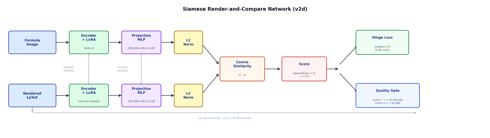
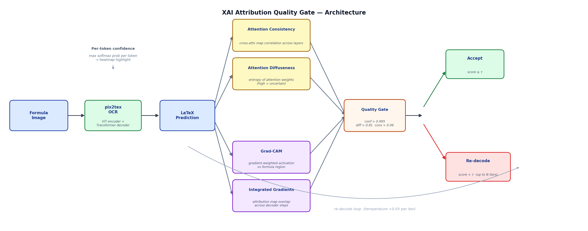

# Self-Correcting LaTeX OCR — Render-and-Compare & XAI Quality Gates

---

## Overview

[pix2tex](https://github.com/lukas-blecher/LaTeX-OCR) is a state-of-the-art Vision Transformer OCR model that decodes formula images into LaTeX. This project wraps it with a **self-correcting feedback loop** using two independent strategies:

| | Approach 1 | Approach 2 |
|---|---|---|
| **Name** | Siamese Render-and-Compare | XAI Attribution Quality Gate |
| **Signal type** | External — render prediction, compare images | Internal — attention maps & gradients |
| **Feedback mechanism** | Cosine similarity between formula images | Attention consistency, diffuseness, Grad-CAM, IG |
| **Author** | Mohamed Abdelmagid | Ahmed Abdeen |

---

## Approach 1 — Siamese Render-and-Compare

### How It Works

```
Formula Image ──► pix2tex ──► LaTeX Prediction
                                     │
                              Render to Image
                                     │
                    ┌────────────────▼────────────────┐
                    │   Siamese Comparator Network     │
                    │  (shared ViT encoder + LoRA)     │
                    │  Formula Image ◄──► Rendered     │
                    │  cosine_similarity → score       │
                    └────────────────┬────────────────┘
                             score < τ ?
                            /          \
                          Yes           No
                     Re-decode        Accept
                   (up to N iters)
```

### Final Architecture — v2d (Siamese)



| Component | Detail |
|---|---|
| Backbone | Shared pix2tex ViT encoder |
| Fine-tuning | LoRA rank=8, α=16, dropout=0.05 |
| Trainable params | **230,272** / 13,085,504 total (1.76%) |
| Projection MLP | `Linear(256) → BatchNorm → GELU → Linear(128)` |
| Similarity | L2-normalize → cosine similarity |
| Score | `sigmoid(cos_sim × 5)` → [0, 1] |
| Loss | Contrastive hinge loss, margin=1.0 |
| Threshold τ | 0.5 (principled: sigmoid(0)=0.5 ↔ orthogonal embeddings) |

### Architectures Explored

| Variant | Description | Val Accuracy | Val Loss |
|---|---|---|---|
| **v1** | Flat MLP head on frozen encoder | 59.2% → 76.2% | 0.58 → 0.32 |
| **v1 + LoRA** | Same head, LoRA encoder fine-tuning | **79.6%** | 0.296 |
| **v2a** | ResidualHead — skip-connections + BatchNorm | **82.5%** | 0.260 |
| **v2b** | CrossAttentionComparator — cross-attention over token sequences | 77.6% | 0.290 |
| **v2c** | ContrastiveNet — InfoNCE/NT-Xent metric learning | — | — |
| **v2d** ✓ | **True Siamese** — shared encoder + hinge loss | **55.4%*** | 0.287 |

> *v2d accuracy is on a harder evaluation set with hard-negative mutations only (no easy random negatives), making it directly comparable to real-world OCR errors — hence lower but more meaningful than v2a/v2b.

### Training Details (v2d)

| Parameter | Value |
|---|---|
| Training images | 12,000 |
| Validation images | 2,000 |
| Target training pairs | 20,000 |
| Target validation pairs | 500 |
| Epochs | 10 |
| Batch size | 64 |
| Hard-negative probability | 0.5 |
| LoRA rank | 8 |

### Pair-Type Evaluation (v2d)

| Pair Type | Count | Accuracy |
|---|---|---|
| Type 1 — Positive (exact render) | 250 | **98.8%** |
| Type 2 — Negative (mutation) | 184 | 3.3% |
| Type 3 — Negative (nearby bucket) | 34 | 17.6% |
| Type 4 — Negative (random formula) | 32 | 28.1% |
| **Overall** | **500** | **53.6%** |

> Domain mismatch: the model excels at detecting that correct pairs match (98.8%) but struggles to reject real OCR errors that look visually similar to correct predictions (low Type 2–4 accuracy).

### Head-Only Ablation Runs

| Run | Epochs | Train rows | Hard-neg prob | Val Accuracy |
|---|---|---|---|---|
| smoke (debug crash) | 1 | 800 | 0.4 | 70.3% |
| identity smoke | 1 | 3,000 | 0.4 | 100.0% |
| head_main | 2 | 12,000 | 0.4 | 66.5% |
| head_hardneg_types | 2 | 12,000 | 0.4 | 72.4% |
| head_hardneg_types_v2 | 2 | 12,000 | 0.4 | 75.5% |
| head_long_resample | 2 | 12,000 | 0.4 | 76.2% |
| head_upgrade_main (annealed) | 2 | 12,000 | 0.3→0.6 | 66.2% |
| lora_main | 2 | 20,000 | 0.65 | **79.6%** |

---

## Approach 2 — XAI Attribution Quality Gate

### How It Works



Instead of external rendering, the XAI gate inspects the model's **own internal signals** during decoding to decide if the prediction is trustworthy.

### XAI Signals

| Signal | What it measures | Threshold |
|---|---|---|
| **Token Confidence** | Mean max-softmax probability per decoded token | > 0.995 |
| **Attention Diffuseness** | Entropy of cross-attention weights (high = uncertain, model is "looking everywhere") | < 0.81 |
| **Attention Consistency** | Correlation of cross-attention maps across decoder layers (low = inconsistent) | > 0.06 |
| **Grad-CAM** | Gradient-weighted spatial activation alignment with formula region | — |
| **Integrated Gradients** | Attribution map overlap across decoder steps | — |

### Quality Gate Presets

| Preset | Confidence | Diffuseness | Consistency | Use case |
|---|---|---|---|---|
| `balanced` | 0.90 | 0.85 | 0.05 | General |
| `strict_conf` | 0.995 | 1.0 | 0.0 | Confidence-only filter |
| `diff_sensitive` | 0.0 | 0.80 | 0.0 | Attention spread detection |
| `cons_sensitive` | 0.995 | 0.81 | 0.06 | **Best overall** |
| `lenient` | 0.80 | 0.95 | 0.02 | Low rejection rate |

### XAI Results

| Metric | Baseline | After 1 Re-decode (XAI gate) | Δ |
|---|---|---|---|
| BLEU | 0.8119 | 0.8170 | **+0.0051 (+0.5%)** |
| Exact Match | 0.344 | — | — |
| CER ↓ | 0.2377 | — | — |

> **Key result:** A single re-decode pass triggered by the XAI quality gate yields **+0.5% BLEU** improvement with zero external model or rendering needed.

---

## Repository Structure

```
├── code/
│   ├── train_comparator_hf.py              # v1 architectures + head-only training
│   ├── train_comparator_hf_v2.py           # v2a/v2b/v2c/v2d + LoRA
│   ├── self_correcting_render_compare.py   # Full pipeline: OCR + render + compare loop
│   ├── generate_comparator_dataset.py      # Pre-render training pairs to disk
│   ├── evaluate_pix2tex_gd.py              # Baseline pix2tex evaluation (30K images)
│   ├── evaluate_full_pipeline_test.py      # End-to-end pipeline evaluation
│   ├── evaluate_pipeline_from_existing.py  # Pipeline eval from saved predictions
│   ├── compute_consistency_scores.py       # XAI: attention/Grad-CAM/IG scoring
│   ├── run_full_test_sweeps.py             # XAI: sweep all quality gate presets
│   ├── plot_xai_scores.py                  # XAI: visualise score distributions
│   ├── cli.py                              # Modified pix2tex CLI with XAI hooks
│   └── pix2tex_xai/
│       ├── consistency.py                  # Attribution consistency scoring
│       ├── gradcam.py                      # Grad-CAM implementation
│       ├── integrated_gradients.py         # Integrated Gradients (Captum)
│       ├── trace.py                        # Attention trace utilities
│       └── viz.py                          # Visualisation helpers
├── live_demo/
│   ├── app.py                              # Flask web app
│   ├── templates/index.html                # UI with MathJax rendering
│   └── static/style.css                   # Dark theme
├── results/
│   ├── data/
│   │   ├── full_nlp_metrics.json           # All metrics for all pipeline variants
│   │   ├── pipeline_metrics_v2d.json       # v2d pipeline detailed results
│   │   └── pipeline_iter_sweep_metrics.csv # Full τ × iterations sweep table
│   └── figures/                            # All plots + architecture diagrams
└── requirements.txt
```

---

## Live Demo

A Flask web app for real-time formula OCR with quality feedback:

- Upload a formula image → pix2tex decodes to LaTeX rendered via **MathJax**
- **Per-token confidence heatmap** (red = low confidence, green = high)
- **XAI quality gate** decision with configurable thresholds
- **Iterative re-decoding** showing confidence heatmap at each iteration

```bash
pip install -r requirements.txt
python live_demo/app.py
# → http://127.0.0.1:5000
```

---

## Installation & Running

```bash
# 1. pix2tex OCR backbone (downloads weights automatically)
pip install "pix2tex[gui]"

# 2. PyTorch with CUDA 11.8
pip install torch torchvision torchaudio --index-url https://download.pytorch.org/whl/cu118

# 3. All other dependencies
pip install -r requirements.txt

# 4. NLTK data (for METEOR metric)
python -c "import nltk; nltk.download('wordnet'); nltk.download('omw-1.4')"
```

```bash
# Evaluate baseline pix2tex (30K test images)
python code/evaluate_pix2tex_gd.py

# Train Siamese v2d comparator
python code/train_comparator_hf_v2.py --arch v2d --output-dir results_v2d \
  --hard-negative-prob 0.5 --margin 1.0 --epochs 10 --lora-rank 8 --fp16

# Evaluate full self-correcting pipeline
python code/evaluate_pipeline_from_existing.py --arch v2d \
  --comparator-checkpoint <path/to/comparator.pt> --tau 0.5 --max-iters 2

# Run XAI quality gate sweep (all presets)
python code/run_full_test_sweeps.py --data-dir data/formulae_extracted_full/test
```

---

## Tech Stack

`PyTorch` · `HuggingFace Transformers` · `LoRA` · `pix2tex` · `timm` · `Flask` · `Captum` · `sacrebleu` · `rouge-score` · `jiwer` · `matplotlib` · `MathJax`
